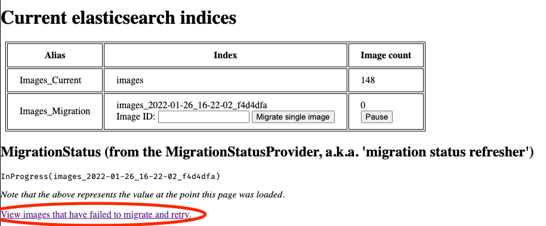

# How to run a migration

Migrations are primarily controlled from the Thrall dashboard, an HTTP page
exposed on Thrall's domain.

## Preparation

Running a migration requires a lot of computation - each image in your library
must be projected, which involves downloading and reprocessing the original
image from scratch. For this reason, we suggest running a second pool of
image-loader instances reserved specifically for projection. These are usually
hosted at the `loader-projection.media.` domain prefix, though you can of course
reuse your primary pool of image-loader instances by setting the
`hosts.projectionPrefix` configuration option to the same value as the
`hosts.loaderPrefix` option (defaults to `loader.media.`). Be aware though that
doing so may cause slowdown or disruption to users uploading images. Take care
to scale whichever pool of image-loader instances to an appropriate size.

<!-- TODO offer a config option to tune Thrall's parallelism of projection
requests? Currently hardcoded to 50, we used 6x m5.large in first migration -->

You will also experience an increased usage of your DynamoDB tables and
Elasticsearch cluster, so make sure to watch their performance and scale both to
match their usage. We recommend
[enabling autoscaling on all DynamoDB tables and indices](https://docs.aws.amazon.com/amazondynamodb/latest/developerguide/AutoScaling.html)
where possible.

### For Guardian users

The size of the image projection ASGs are dictated by Cloudformation parameters, `ProjectionServiceAutoscalingMinSize` and `ProjectionServiceAutoscalingMaxSize` – alter these to scale the service.

As a baseline for running a migration, 4 Elasticsearch nodes and 5 `loader-projection` instances was a good place to start for our configuration on 18/05/22, with an index of ~40,000,000 images.

## Starting

A migration can be started by going to the Thrall dashboard and following the
prompt to press the 'Start Migration' button. This will create a new index using
the latest version of the mappings (see
[Mappings.scala](../../common-lib/src/main/scala/com/gu/mediaservice/lib/elasticsearch/Mappings.scala))
and then
[assign the "Images_Migration" alias](./01-about.md#migration-status-flag).
Thrall will then automatically begin searching for and queueing images for
migration.

## Running

While a migration is running, you can track progress on the Thrall dashboard,
which will display a count of images that exist in each index. The form to start
a migration has been replaced with a form that will allow you to manually queue
an image for migration, regardless of whether Thrall has attempted to migrate it
previously.

## Finishing

While the migration is in progress, a form will be present on the Thrall
dashboard with the option of completing the migration. You should only do this
once the number of images in Images_Migration is equal to the number in
Images_Current. You may optionally choose to leave some images that have failed;
these will remain available for review in the list of errored images (see
[below](#troubleshooting)).

When you submit the migration completion form, the Images_Current alias will be
moved to the new index, the Images_Migration alias will be removed, and the
Images_Historical alias will be added pointing to the old index. This should all
happen seamlessly without impacting any concurrent uploads or edits.

## Troubleshooting

Errors may occur while migrating an image --- this may include failing to
project the image, failing to insert into the new index, or something else. The
list of failures is available on the Thrall dashboard, behind the "View images
that have failed to migrate" link.

On this page, you can see an overview of the images that have failed to migrate,
grouped by the failure message. You can click through into the groups to get a
full list of failed images and a button to easily retry them.

Caveat: Currently the failure messages may not be very descriptive due to how
error messages are passed through Grid services. Be aware that one group of
errors in the dashboard _may_ have multiple different root causes. Try searching
the logs using the image ID to find the original error, whichever service that
originates from.

